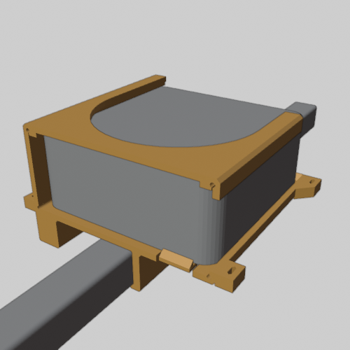
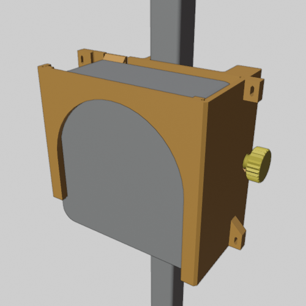
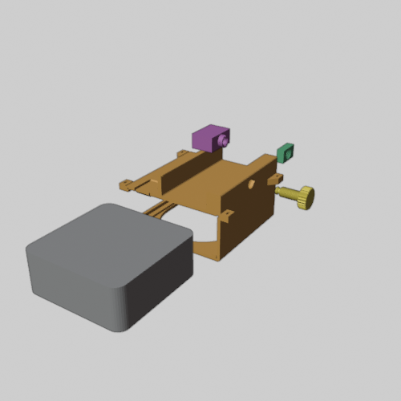

# Mac mini tube mount

A 3D-printable cradle that clamps a Mac mini (127 × 127 × 50 mm) to a 1" (25.4 mm) square tube whose bottom face is velcroed down.
- **Tube velcroed down:** the Mac sits upside-down on top of it, centered, with its vented foot facing up and open.
- **Vertical tube:** the Mac hangs front-up, with the back-panel cables pointing down.

The clamp grips only the tube's two side faces, so nothing wraps around the velcro face. A small lip on the fixed side hooks 2.5 mm over one edge. Four zip-tie eyes at the corners, beside the tube, let you tie the cradle down as well; they take standard 4.8 mm ties. Four parts, all printed in PETG, with no metal hardware and no supports.



## Print

The STLs in `out/macmini/stl/` are already in print orientation, sitting on Z = 0. They were sized for a Bambu P1S (256 mm bed).

| File | Color in renders | Print orientation | Settings |
|---|---|---|---|
| `cradle.stl` | orange | front face down | 4 walls, 35% infill, brim |
| `nut.stl` | green | thread vertical | 100% infill |
| `screw_4a.stl` | yellow | wheel down | 100% infill |
| `pad.stl` | purple | grip face down | 100% infill |

Or open the ready-made plates in `out/macmini/plates/`. Each object's name lists its settings:
- `plate1_test_pieces.3mf`: the nut, a short screw stub and a 10 mm slice of the clamp. Print this first to check the thread and the tube fit. If they fit, keep the nut as a spare.
- `plate2_parts.3mf`: all four parts on one 256 mm bed.

## Assemble

1. Slide the Mac into the cradle from the front until the roof tab clicks over its front edge. The back lip stops it at the rear.
2. Drop the nut into its slot from the back of the cradle, sliding it down to the middle.
3. Thread screw 4a in from the side, through the wall and the nut, until its tip comes out on the inside. Snap the pad onto the tip.
4. Back the screw off. Hook the fixed jaw's lip under one edge of the tube, lower the cradle onto it, and tighten the screw until the pad grips the tube.
5. Optionally, run zip ties through the corner eyes to whatever the tube is mounted on.

## Rebuild from source

The geometry comes from one Blender script (tested on Blender 5.2):

```bash
blender -b --factory-startup --python build_macmini_mount.py
```

It rebuilds every part, checks fits and printability and that nothing reaches the tube's velcro face, and writes the STLs, plates and renders to `out/macmini/`. Dimensions are constants at the top of the script. For example, `RAD_CL` sets the thread clearance and `LIP_REACH` the lip size.

[NOTES_macmini.md](NOTES_macmini.md) lists the design decisions, the measured clearances, and the open issues. Check the ones about your Mac, your tube and your velcro before printing everything.

## Views

| Vertical tube | Exploded |
|---|---|
|  |  |
